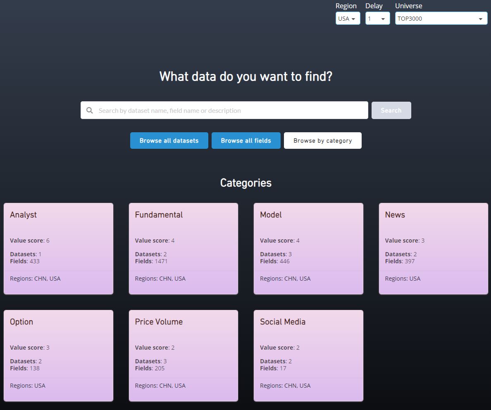
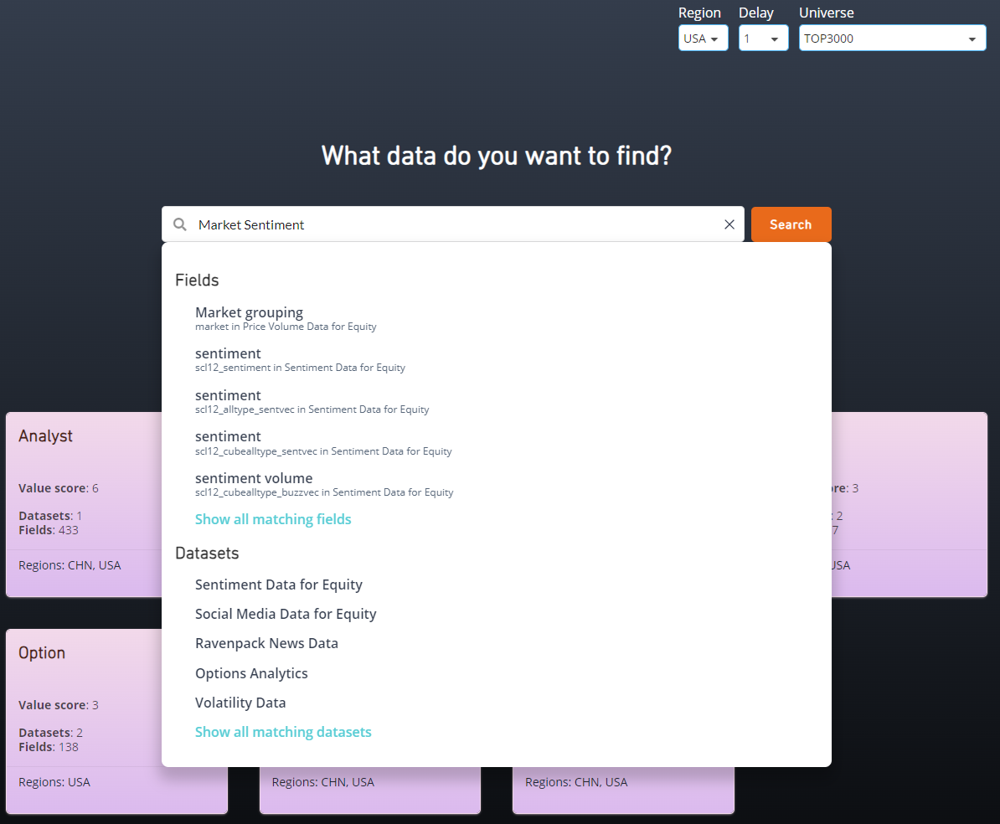
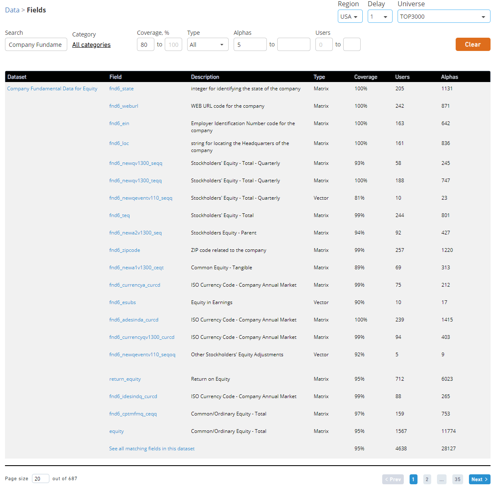
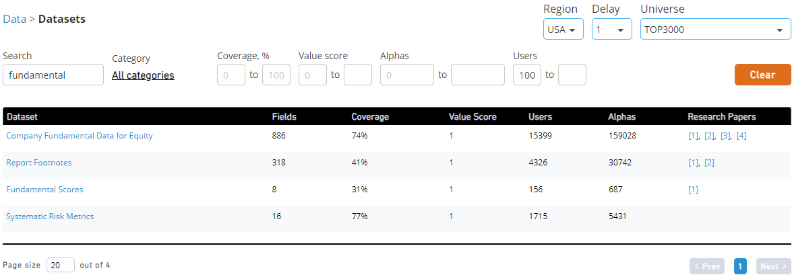
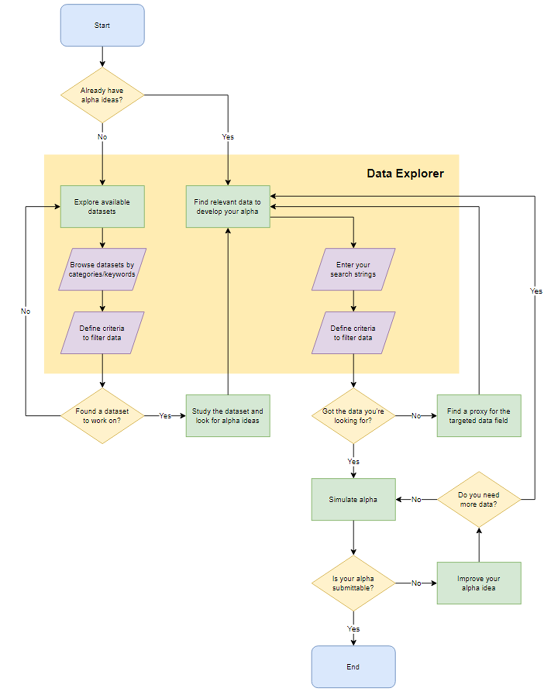

# How to use the Data Explorer

Source: https://platform.worldquantbrain.com/learn/documentation/understanding-data/how-use-data-explorer
Last modified: 2025-03-12T05:53:18.035922-04:00

## Data Explorer

Powered by advanced AI technologies, such as NLP, the [Data Explorer](https://platform.worldquantbrain.com/data) helps you quickly and accurately identify the data fields to implement your idea.

### Searching for fields based on an idea

Let’s say you have an Alpha idea using market sentiment. You can easily search for related datasets and data fields in the Data Explorer. Notice that you will have to pre-define region, delay and universe prior to your search. Some data fields are present only in certain regions and delays.

### Searching for fields based on specific criteria

You can filter data fields based on criteria such as coverage, type, count of Alphas and users. For example, you can search for high coverage data fields from Company Fundamental Data for Equity dataset in CHN region and were used in at least 5 submitted Alphas. You can later sort these data fields by Alpha count to see which fields are used less, i.e., less crowded.

### Searching and filtering datasets

While you can click on the “browse by category” button, you can also search for datasets using “dataset category” or “dataset name”. This is helpful because it also allows you to filter these datasets by coverage, value score and crowdedness (measured by Alpha and user count). For example, you can search for datasets related to “fundamental” that have more than 100 active users. Note that you have to go to the “Datasets” tab to see the results.

## Rule of thumb when searching for data fields

Try to follow the 3Ss rule: keep your searches short, simple and straightforward. Try to use terminologies within your searches to increase the chance of finding the data fields you are looking for. In case you aren’t sure of the correct terminology, first try explaining it using your own words. For example, if you are looking for “insider trading” data but haven’t quite found the phrase, try, “trade by people inside company” and you can achieve the results.

## Maximize your results!

For some well-known concepts, try searching for the abbreviations along with the full name. This simple practice will not only increase your chances of finding the data fields that you are looking for but you can also obtain additional options to choose from. For example, try searching for both “earnings per share” and “eps,” both “implied volatility” and “IV”, etc.

The flowchart below is a suggested research framework with the inclusion of Data Explorer. You can use it as a reference for creating one for yourself.

